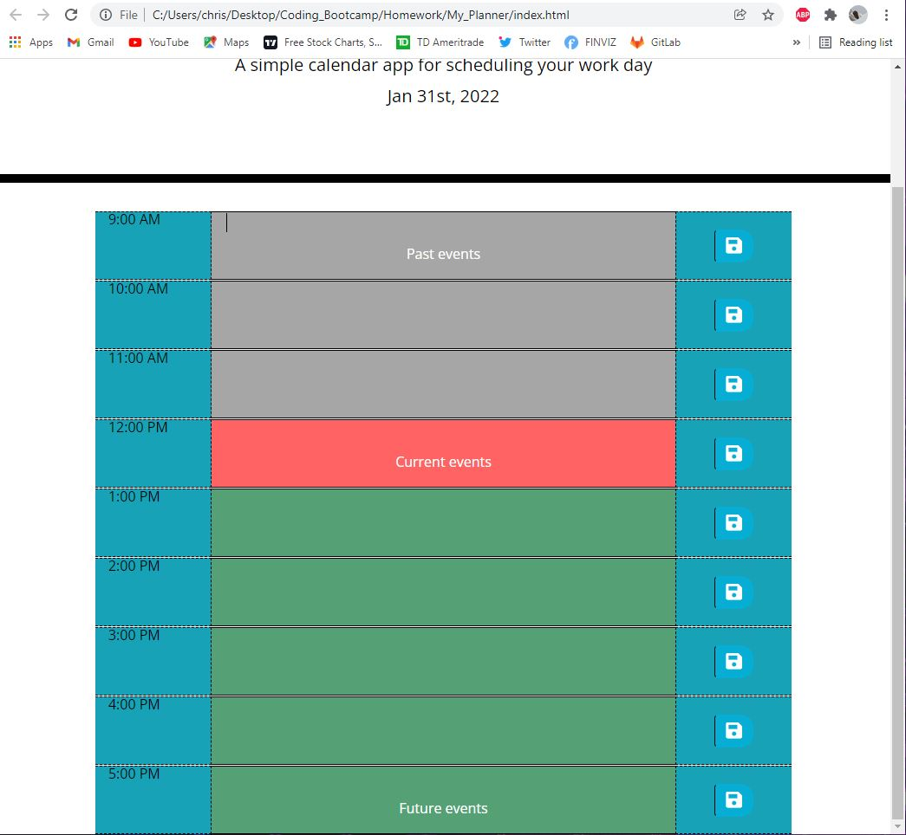

# My_Planner

* In this assignment we were tasked with creating a work day planner that would show the user the current, past, and future hours of the day by color coding each section. The information the user puts in the text input areas of the page could then be saved using local storage and then be seen in each respective area upon refreshing.

* By using moment.js I was able to get the current day to display on the screen by creating a variable of the moment data and altering the text content where I wanted the information to be displayed. I also used moment to set a variable for the current time based solely on the hour so I could create a function to change the background colors of sections based on the current time. (js:65)

* Using local storage and seperate variables for various input IDs I was able to link the button in each section to store the information entered by the user with keys that were called upon in the getLocal function (js:32). The information would then display in their respective sections of the page. I learned that if the ids for each input contained the same thing jQuery was unable to differentiate which section I was calling on. So by changing the ids of each from "text-input input-..." to just "input-..." it allowed jQuery to process the info that was typed to each section accordingly.

* Technologies used: HTML, CSS, Javascript, Moment.js

* License: MIT

* Contact: chris.tierney3@gmail.com

Links --> https://github.com/christierney3/My_Planner
          https://christierney3.github.io/My_Planner/

